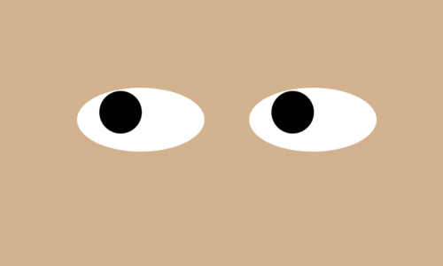

# Eyes Assignment
## Directions: To create a code that included two eyes that follow the cursor of the user on the page.

### Description:
-This project uses functions as well as acessing the DOM objects in order to create the appearance of two eyes following the viewers cursor.

-I have changed the background color to a nude color in order to make it more realistic and have added another eye on the page so it was not only one.

### How to run: 
1. Fork repository
2. Clone repo
3. Drag the eyes.html file onto your browser.
4. Move cursor around the page to see the eye balls follow your every move.

### Future Improvements
-In the future I would like to debug and fix the code I have commented out that was meant to make the an colored iris around each eye ball.
-I would also like to code other facial features to make the eyes lie on a complete face.

### License Information
MIT License

Copyright (c) 2020 John Williams

Permission is hereby granted, free of charge, to any person obtaining a copy
of this software and associated documentation files (the "Software"), to deal
in the Software without restriction, including without limitation the rights
to use, copy, modify, merge, publish, distribute, sublicense, and/or sell
copies of the Software, and to permit persons to whom the Software is
furnished to do so, subject to the following conditions:

The above copyright notice and this permission notice shall be included in all
copies or substantial portions of the Software.

THE SOFTWARE IS PROVIDED "AS IS", WITHOUT WARRANTY OF ANY KIND, EXPRESS OR
IMPLIED, INCLUDING BUT NOT LIMITED TO THE WARRANTIES OF MERCHANTABILITY,
FITNESS FOR A PARTICULAR PURPOSE AND NONINFRINGEMENT. IN NO EVENT SHALL THE
AUTHORS OR COPYRIGHT HOLDERS BE LIABLE FOR ANY CLAIM, DAMAGES OR OTHER
LIABILITY, WHETHER IN AN ACTION OF CONTRACT, TORT OR OTHERWISE, ARISING FROM,
OUT OF OR IN CONNECTION WITH THE SOFTWARE OR THE USE OR OTHER DEALINGS IN THE
SOFTWARE.
